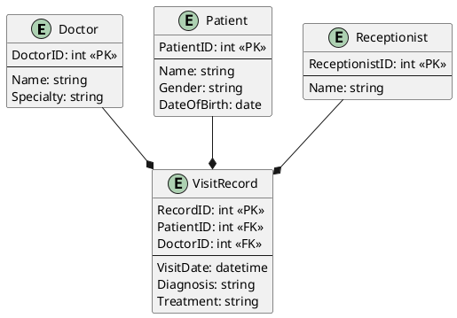

```plantuml
@startuml
ENTITY Doctor {
  DoctorID: int <<PK>>
  --
  Name: string
  Specialty: string
}

ENTITY Patient {
  PatientID: int <<PK>>
  --
  Name: string
  Gender: string
  DateOfBirth: date
}

ENTITY VisitRecord {
  RecordID: int <<PK>>
  PatientID: int <<FK>>
  DoctorID: int <<FK>>
  --
  VisitDate: datetime
  Diagnosis: string
  Treatment: string
}

ENTITY Receptionist {
  ReceptionistID: int <<PK>>
  --
  Name: string
}

Doctor  --* VisitRecord 
Patient --* VisitRecord 
Receptionist  --* VisitRecord 
@enduml
```